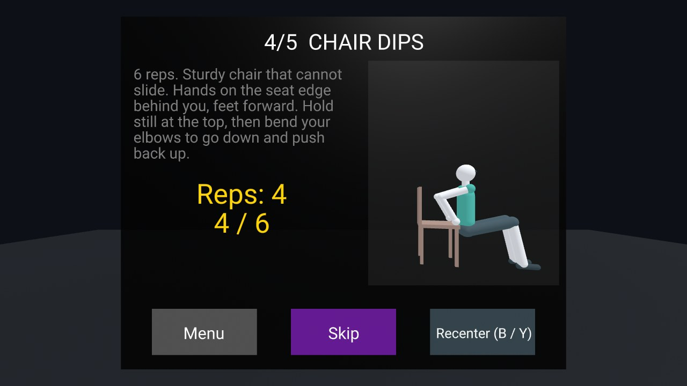
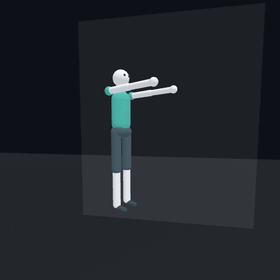
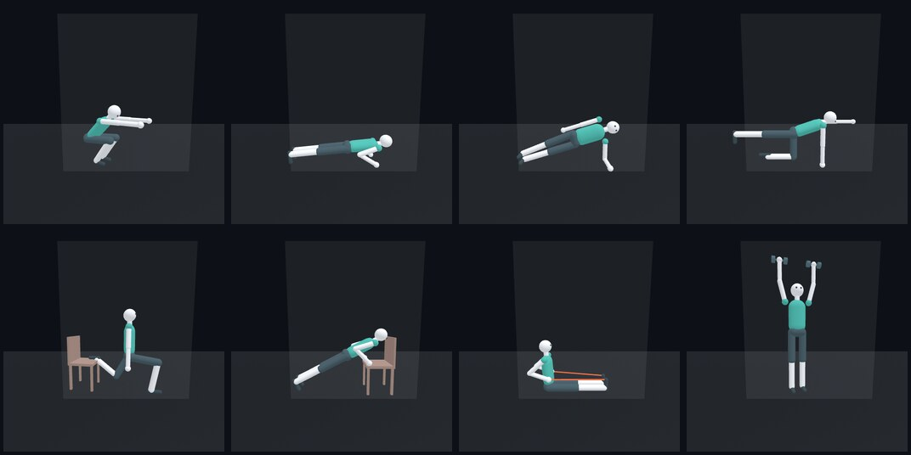
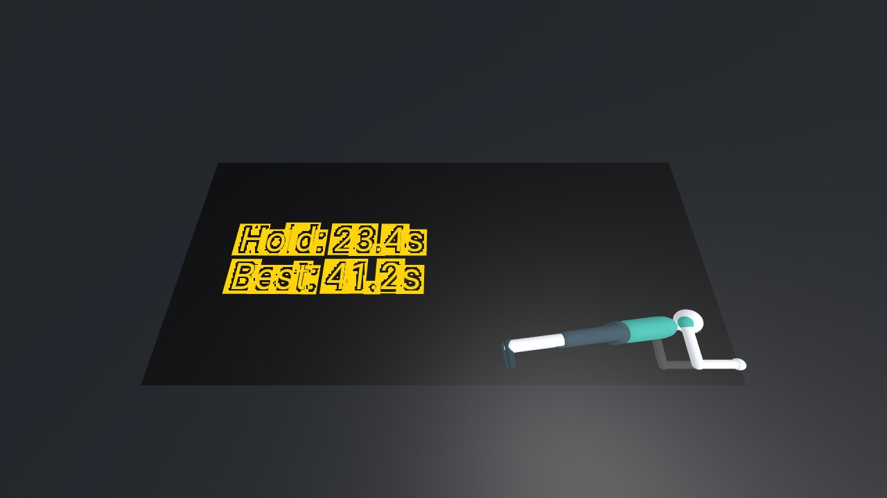
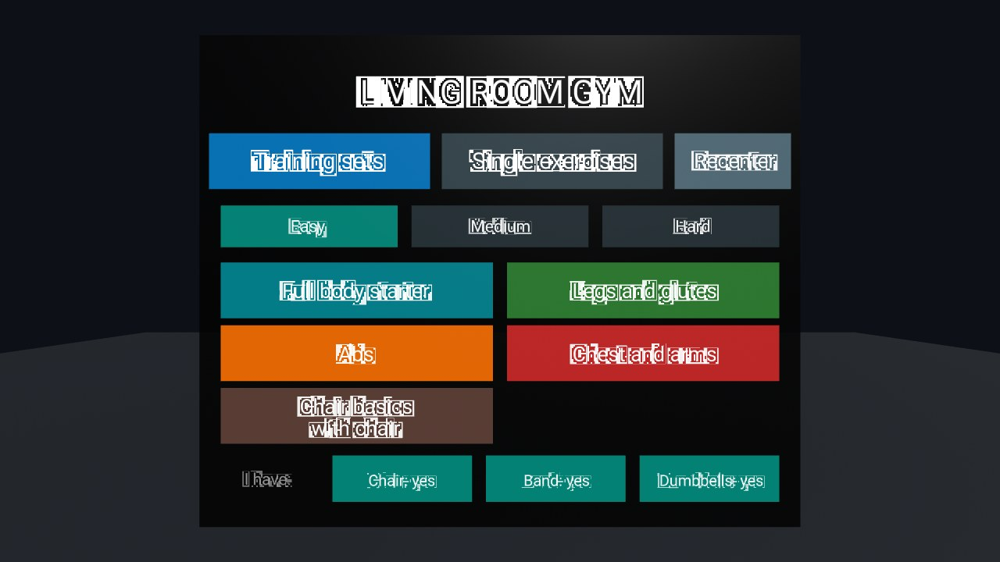
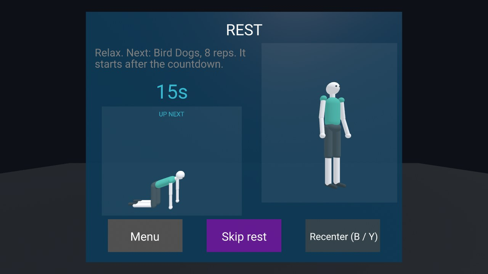
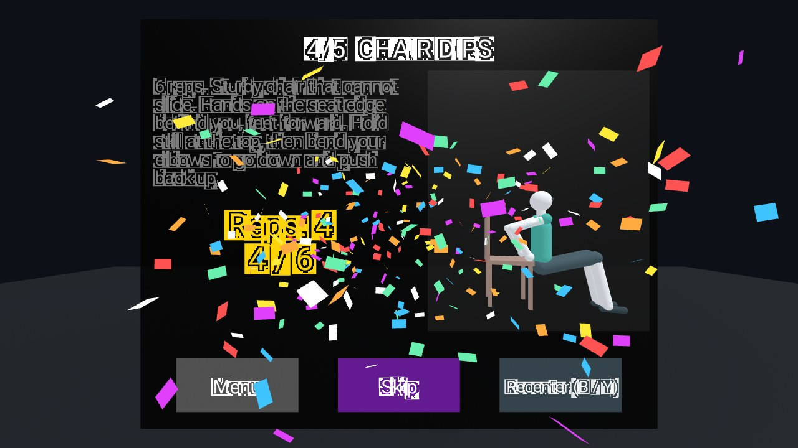
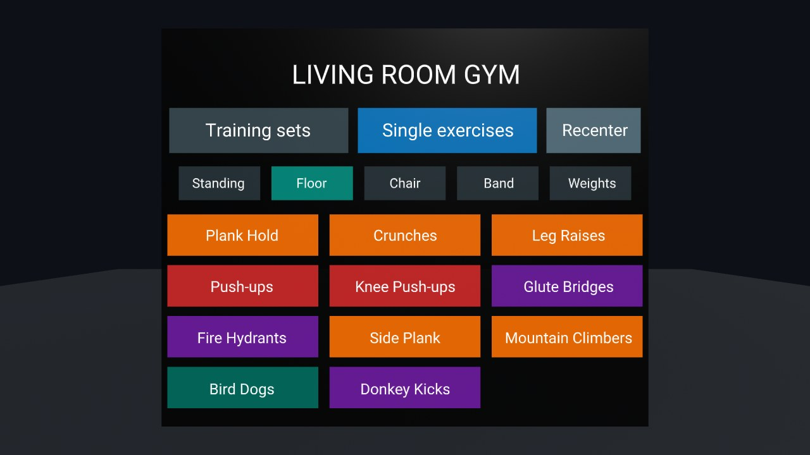

# Living Room Gym

**A mixed reality home workout for Meta Quest.** A friendly coach shows you each move right
in your living room, and the headset counts your reps and times your holds. There's nothing to
install and no account: it runs in the Quest Browser.

**[Open Living Room Gym](https://valentinp72.github.io/living-room-gym/)**: on your Quest,
open the link in the Browser and tap **AR**.

> [!WARNING]
> **You use this app at your own risk.** Exercising while wearing a headset can lead to falls,
> collisions and strain. Clear the space around you (furniture, walls, stairs, pets, people),
> keep passthrough on and stay aware of your room, and stop at once if you feel pain,
> dizziness or discomfort. If you have a health condition, an injury or are pregnant, ask a
> doctor before training. Rep counts, timers and demos are guides, not medical or coaching
> advice. The app is provided "as is", without warranty of any kind (see [LICENSE](LICENSE)),
> and the authors accept no responsibility for any injury or damage resulting from its use.
>
> The app shows [a short version of this notice](docs/screenshots/safety.jpg) before its first use on each device.

## Features

### Train in your own room

Living Room Gym is mixed reality only: the panels and the coach float in your real room, seen
through the Quest's passthrough cameras. There is deliberately no VR mode, because you should
always see where you are while you exercise.

### A coach that shows every move

A small, friendly avatar demonstrates each exercise, with the chair, band or dumbbells when
the exercise needs them. On the floor, it lies next to your counter so you can check your form
without looking up.

  

### Reps counted for you

Most exercises are counted automatically from how your head and hands move: squats, lunges,
push-ups, crunches, curls, chair dips and more. Planks, side planks and wall sits are timed on
their own: get in position and the timer starts; stop and it stops. No buttons to press
mid-exercise. For moves the headset can't follow, the app sets the pace with a beat and counts
along with you.

Every counted rep gets a little ding. When you're on the floor, the counter comes to you: on
the floor under your face in a plank, or above you when you lie on your back.

### Training sets for every level

Pick a training set and follow it: each step has a target, with a rest in between. There are
15 sets at three levels. Harder sets have more reps, longer holds and shorter rests.

Rest looks clearly different from exercise, so you never start too early: a blue screen, a
countdown, and "GET READY" with three beeps before the next step. While the coach rests, a
smaller one shows what's up next, so you can get ready for it. Finish a step and you get
confetti; finish the whole set and you get a lot more.

| Resting | Step done |
|---|---|
|  |  |

### 31 exercises, at home

Everything can be done at home. Many exercises need nothing; others use a sturdy **chair**, an
elastic **band** or **dumbbells**. Tell the app what you have and it only shows the training
sets you can do. The **Single exercises** tab lists every exercise on its own, without a
target, to try it out.

### Controllers or bare hands

Point and click with the controllers, or put them down and pinch with your fingers. With a
band or dumbbells in your hands, hand tracking is the easy way.

## Getting started

1. **Clear some space**: about 2 × 2 m, with room to lie down.
2. On your Quest, open **[valentinp72.github.io/living-room-gym](https://valentinp72.github.io/living-room-gym/)**
   in the Browser and tap **AR** (bottom right).
3. Read the safety notice and tap **I understand** (only the first time).
4. Pick a training set (start with **Easy**), or a single exercise.
5. Follow the coach. Your reps are counted on the panel.

**Tips**

- **Panels in the wrong place?** Press **Recenter**, **B** or **Y**, or use the Quest's own
  recenter (hold the Meta button). On the menu, the panel also follows you when you turn away.
- **Standing exercises** start with "Stand still...": stand straight for a second so the app
  learns your height.
- **Not counted?** For holds, the counter tells you what's off, like `Head lower (85 cm)`.
- **Skip** jumps to the next step or ends a rest early.
- On a computer, the same link opens a preview: look around with the mouse and click the
  panels. Nothing is counted there, but you can see every exercise.

## Training sets

| Training set        | Level  | Rest | Needs            | Steps |
|---------------------|--------|------|------------------|-------|
| Full body starter   | Easy   | 20 s |                  | 10 squats, 10 bicep curls (each arm), 20 s plank |
| Legs and glutes     | Easy   | 20 s |                  | 10 squats, 10 lunges, 10 fire hydrants, 10 glute bridges, 15 calf raises |
| Abs                 | Easy   | 20 s |                  | 10 crunches, 8 leg raises, 20 s plank, 10 crunches |
| Chest and arms      | Easy   | 25 s |                  | 8 knee push-ups, 10 curls, 8 knee push-ups, 10 curls |
| Chair basics        | Easy   | 25 s | chair            | 10 chair squats, 8 incline push-ups, 10 glute bridges, 6 chair dips, 8 bird dogs |
| Full body           | Medium | 15 s |                  | 15 squats, 10 push-ups, 16 lunges, 15 crunches, 15 glute bridges, 40 s plank |
| Core                | Medium | 15 s |                  | 15 crunches, 20 mountain climbers, 20 s side plank each side, 10 leg raises, 10 bird dogs, 40 s plank |
| Legs and glutes     | Medium | 15 s | a wall           | 15 squats, 16 lunges, 40 s wall sit, 16 donkey kicks, 15 glute bridges, 20 calf raises |
| Band workout        | Medium | 20 s | band             | 15 band pull-aparts, 16 band side steps, 15 band rows, 15 squats, 15 band pull-aparts, 15 glute bridges |
| Dumbbell full body  | Medium | 20 s | dumbbells        | 12 goblet squats, 10 shoulder presses, 12 bent-over rows, 12 Romanian deadlifts, 12 curls, 10 lateral raises |
| Full body challenge | Hard   | 12 s | chair            | 30 jumping jacks, 15 push-ups, 10 split squats each leg, 30 mountain climbers, 15 chair dips, 60 s plank |
| Core crusher        | Hard   | 10 s |                  | 25 crunches, 15 leg raises, 30 s side plank each side, 40 mountain climbers, 16 bird dogs, 75 s plank |
| Leg day             | Hard   | 12 s | dumbbells, chair | 20 goblet squats, 15 Romanian deadlifts, 10 split squats each leg, 60 s wall sit, 30 calf raises, 20 lunges |
| Upper body          | Hard   | 12 s | dumbbells, chair | 20 push-ups, 15 bent-over rows, 15 shoulder presses, 15 chair dips, 12 lateral raises, 15 curls |
| Cardio blast        | Hard   | 10 s |                  | 40 jumping jacks, 30 mountain climbers, 20 squats, 12 push-ups, 40 jumping jacks, 30 mountain climbers |

For exercises that alternate sides (mountain climbers, bird dogs, donkey kicks, fire
hydrants), each side counts as one rep. One-sided exercises (side plank, split squats) have a
step for each side; the side plank checks you're on the right one.

## Exercises

**Counted**: the app counts your reps. **Timed**: the app times your hold. **Beat**: the app
sets the pace with a tick and counts along; follow the coach.

| Exercise           | Works      | Needs     | How |
|--------------------|------------|-----------|-----|
| Squats             | Legs       |           | Counted |
| Lunges             | Legs       |           | Counted |
| Calf Raises        | Legs       |           | Beat, every 2 s |
| Wall Sit           | Legs       | a wall    | Timed |
| Jumping Jacks      | Cardio     |           | Beat, every 1.5 s |
| Bicep Curls        | Arms       | dumbbells optional | Counted, each arm |
| Plank Hold         | Abs        |           | Timed |
| Side Plank         | Abs        |           | Timed, one exercise per side |
| Crunches           | Abs        |           | Counted |
| Leg Raises         | Abs        |           | Beat, every 3 s |
| Mountain Climbers  | Abs        |           | Beat, a knee every second |
| Push-ups           | Chest      |           | Counted |
| Knee Push-ups      | Chest      |           | Counted |
| Glute Bridges      | Glutes     |           | Beat, every 3 s |
| Fire Hydrants      | Glutes     |           | Beat, every 2.5 s |
| Donkey Kicks       | Glutes     |           | Beat, every 2 s |
| Bird Dogs          | Back       |           | Beat, every 3 s |
| Chair Dips         | Arms       | chair     | Counted |
| Incline Push-ups   | Chest      | chair     | Counted |
| Chair Squats       | Legs       | chair     | Counted |
| Split Squats       | Legs       | chair     | Counted, one exercise per leg |
| Band Pull-Aparts   | Back       | band      | Beat, every 2.5 s |
| Band Rows          | Back       | band      | Beat, every 2.5 s |
| Band Side Steps    | Glutes     | band      | Beat, every 1.5 s |
| Goblet Squats      | Legs       | a dumbbell | Counted |
| Romanian Deadlifts | Glutes     | dumbbells | Counted |
| Shoulder Press     | Shoulders  | dumbbells | Beat, every 2.5 s |
| Bent-over Rows     | Back       | dumbbells | Beat, every 2.5 s |
| Lateral Raises     | Shoulders  | dumbbells | Beat, every 3 s |

## Privacy

Nothing leaves your device: no account, no analytics, no server (GitHub Pages only serves the
files). Like any web page, the app can't see the passthrough camera image; it only gets the
headset and hand positions that every AR page gets. It remembers two settings in the browser:
that you accepted the safety notice, and which equipment you have.

## Good to know

- **Made for the Meta Quest Browser**, tested on a Quest 3. Other headsets with passthrough AR
  in the browser may work but haven't been tried.
- **Counting is tuned on one person.** If your reps aren't counted well, please
  [open an issue](https://github.com/valentinp72/living-room-gym/issues) with the exercise
  and the hint the counter showed.
- **The headset can be fooled**: it only sees your head (and hands for curls). A plank on your
  knees counts as a plank, and sitting on a chair counts as a wall sit. It's a coach, not a
  referee.

## Contributing

Bug reports and ideas are welcome in the
[issues](https://github.com/valentinp72/living-room-gym/issues). To run the app locally, run
the tests, or add an exercise or a training set, see [DEVELOPMENT.md](DEVELOPMENT.md).

Screenshots come from the desktop preview (a dark virtual room). In the headset you see your
own room instead.

## License

[MIT](LICENSE) © 2026 Valentin Pelloin. Provided "as is", without warranty: see the safety
notice above.
